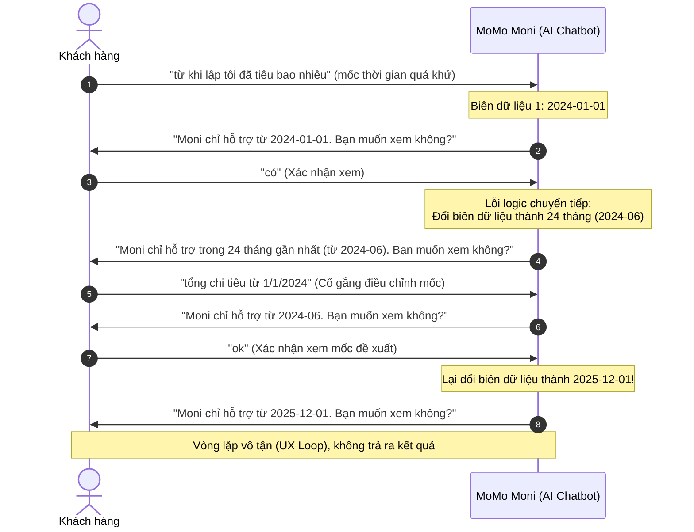
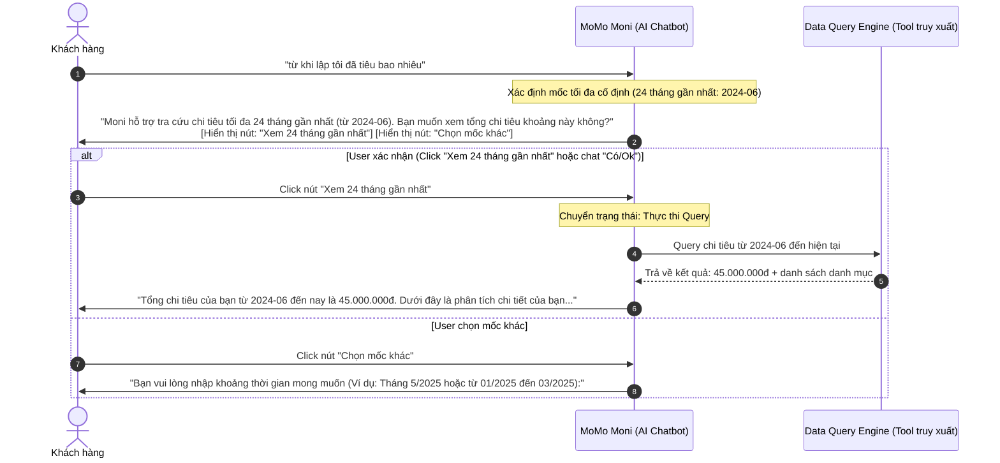

# Workshop — Mổ App AI Thật

**Thời gian:** 35-45 phút  
**Hình thức:** cá nhân trước, chia sẻ theo nhóm sau  
**Output:** finding note + sketch `as-is / to-be`

Mục tiêu không phải chấm "UI đẹp hay xấu". Mục tiêu là dùng sản phẩm thật như một bài needfinding: tìm chỗ product gãy trong workflow thật, rồi viết finding đó thành quyết định product.

---

## 1. Chọn một sản phẩm để dùng thử

* **Sản phẩm lựa chọn:** **MoMo — Moni** (Trợ thủ tài chính, phân tích chi tiêu, chatbot trên ứng dụng MoMo).

---

## 2. Dùng thử: promise vs reality

### **Ghi nhanh:**
* **Product hứa gì?** 
  * Moni hứa hẹn là một trợ thủ tài chính cá nhân thông minh, giúp người dùng tra cứu chi tiêu, phân tích tài chính và giải đáp thắc mắc thông qua giao diện chat tự nhiên, nhanh chóng và chính xác.
* **User nào được hứa sẽ được giúp?**
  * Người dùng MoMo muốn theo dõi, tổng hợp và kiểm soát ngân sách chi tiêu cá nhân một cách tự động mà không cần tự nhập tay hay tính toán thủ công.
* **Bạn kỳ vọng AI làm được task nào?**
  * Kỳ vọng AI nhận diện được câu hỏi về mốc thời gian (dù mơ hồ như "từ khi lập"), tự động kiểm tra giới hạn dữ liệu hỗ trợ, truy vấn tổng số tiền đã chi tiêu và hiển thị báo cáo tổng quan/biểu đồ cho người dùng.
* **Khi dùng thật, điểm gãy xuất hiện ở đâu?**
  * AI bị lỗi logic kiểm soát biên thời gian (data-tool boundary check) và giữ trạng thái hội thoại (session state management). 
  * Cụ thể: AI liên tục thay đổi giới hạn thời gian hỗ trợ (lúc đầu bảo hỗ trợ từ **2024-01-01**, sau đó rút xuống **24 tháng gần nhất - 2024-06**, rồi lại rút xuống **2025-12-01**) mỗi khi người dùng đồng ý với đề xuất của chính nó. Điều này tạo ra một vòng lặp hỏi-xác nhận vô tận (infinite loop) khiến người dùng không thể nhận được dữ liệu chi tiêu.

### **Evidence:**
* **Ảnh chụp bằng chứng:** 
* **Prompt/Input đã thử:**
  1. *User:* `"từ khi lập tôi đã tiêu bao nhiêu"`
  2. *User:* `"có"` (xác nhận xem khoảng thời gian AI đề xuất đầu tiên)
  3. *User:* `"tổng chi tiêu từ 1/1/2024"` (cố gắng sửa lại mốc thời gian ban đầu AI hứa hỗ trợ)
  4. *User:* `"ok"` (xác nhận xem khoảng thời gian AI đề xuất lần hai)
* **Hành vi quan sát được:**
  * Lần 1: AI báo chỉ hỗ trợ từ **2024-01-01** -> User bấm **"Có"** để đồng ý.
  * Lần 2: AI không thực hiện truy vấn mà tự mâu thuẫn báo lại chỉ hỗ trợ **24 tháng gần nhất (từ 2024-06)** -> User gõ lại mốc **1/1/2024**.
  * Lần 3: AI tiếp tục từ chối và nhắc lại mốc **2024-06** -> User bấm **"ok"** để chấp nhận mốc này.
  * Lần 4: AI vẫn không thực hiện truy vấn mà tiếp tục lùi mốc thời gian hỗ trợ xuống **2025-12-01** (chỉ còn khoảng 6 tháng gần nhất) và tiếp tục hỏi câu hỏi xác nhận cũ.

---

## 3. Vẽ 4 paths

| Path | Hành vi hiện tại trong MoMo Moni | Đánh giá & Trạng thái trong sản phẩm |
|---|---|---|
| **Happy** | User hỏi thời gian hợp lệ -> AI truy vấn database -> Trả về kết quả tổng chi tiêu + biểu đồ phân tích lập tức. | **Chưa đạt:** Trong ngữ cảnh thực tế, AI liên tục hỏi lại dù user đã chấp nhận các mốc thời gian hợp lệ. |
| **Low-confidence** | AI nhận diện câu hỏi ngoài giới hạn (ví dụ: "từ khi lập") -> Đưa ra mốc thời gian tối đa hệ thống hỗ trợ kèm nút xác nhận. | **Đã thiết kế tốt phần giao diện (UI):** Có gợi ý khoảng thời gian và nút "Có"/"Không" để user chọn nhanh. |
| **Failure** | Khi user chọn "Có"/"Ok", AI gặp lỗi logic nội bộ, tự thay đổi biên thời gian và lặp lại câu hỏi gợi ý thay vì thực thi lệnh. | **Điểm gãy nặng:** User bị kẹt hoàn toàn, AI tự mâu thuẫn về khả năng hỗ trợ dữ liệu của mình qua mỗi lượt chat. |
| **Correction** | User cố gắng gõ lại mốc thời gian chính xác trong phạm vi ban đầu AI công bố (`1/1/2024`) -> AI bỏ qua ngữ cảnh này và áp đặt giới hạn mới hẹp hơn. | **Chưa đạt:** Hệ thống không lưu trữ/học lại hoặc xử lý thông minh phản hồi chỉnh sửa của user. |

---

## 4. Viết finding thành quyết định

```text
Khi user chấp nhận mốc thời gian gợi ý của AI (bằng cách chat "có" / "ok" hoặc bấm nút xác nhận),
AI/product không thực hiện truy vấn dữ liệu mà liên tục thay đổi giới hạn thời gian hỗ trợ và lặp lại câu hỏi xác nhận,
hậu quả là user bị kẹt trong vòng lặp vô tận (UX loop) và không nhận được bất kỳ số liệu chi tiêu nào.

Lỗi thuộc layer: UX Recovery (Logic chuyển tiếp trạng thái) + Data-tool Layer (Mâu thuẫn biên dữ liệu đầu vào).

Nên sửa bằng:
1. UX Rule: Nếu user đã phản hồi đồng ý ("Có", "Ok", hoặc click nút xác nhận) với khoảng thời gian AI đề xuất, hệ thống phải NGAY LẬP TỨC thực thi tool truy vấn dữ liệu chi tiêu trong khoảng đó, không được hỏi lại hoặc đưa ra câu hỏi xác nhận mới.
2. Data-tool Sync: Đồng bộ hóa chặt chẽ giới hạn thời gian (Time-range boundary) giữa công cụ truy vấn dữ liệu và AI. Giới hạn này phải là hằng số cố định (ví dụ: tối đa 24 tháng gần nhất) trong suốt phiên chat, không thay đổi động một cách tùy tiện sau mỗi câu trả lời.
```

---

## 5. Sketch as-is / to-be

### **Luồng hiện tại (As-is Flow) — Điểm gãy lặp vô tận**



### **Luồng đề xuất (To-be Flow) — Sửa lỗi logic & Xác thực tức thì**



---

## 6. Tự kiểm trước khi nộp

- [x] Có ít nhất 1 screenshot hoặc observation cụ thể (đã chèn [momo.jpg](file:///c:/Users/giang/Desktop/New%20folder/Batch02-Day05-AI-Product-Labs/01-invidual-workshop/momo.jpg)).
- [x] Có đủ 4 paths hoặc nói rõ path nào chưa có trong product.
- [x] Finding được viết thành product decision, không chỉ là nhận xét chung chung.
- [x] Sketch có đầy đủ luồng hiện tại (As-is) và đề xuất (To-be) bằng sơ đồ trực quan.
- [x] Có một câu nói rõ finding này sẽ đổi gì trong SPEC (đã bổ sung chi tiết trong phần UX Rule và Data-tool Sync).

