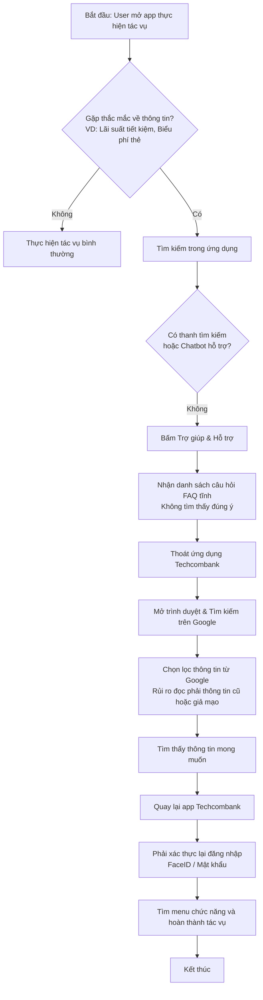
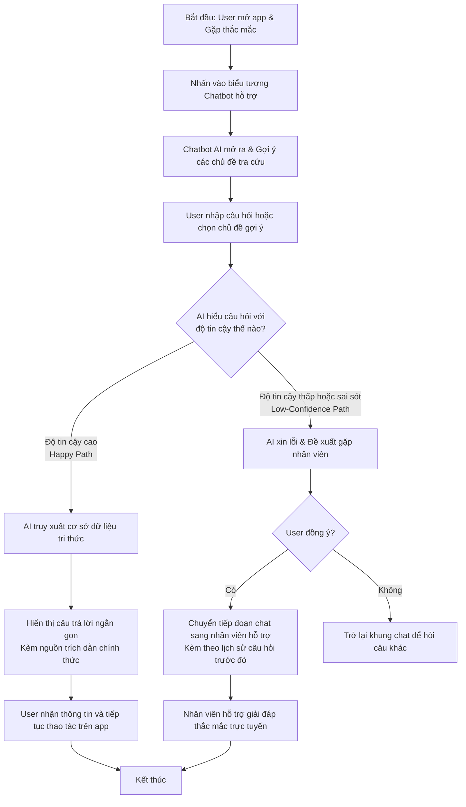

# Đặc tả Sản phẩm — Thin SPEC Chatbot Techcombank (Phiên bản Q&A)

Tài liệu đặc tả sản phẩm rút gọn cho tính năng Chatbot AI hỗ trợ hỏi đáp thông tin (Lãi suất, Biểu phí, Dịch vụ) tích hợp trên ứng dụng Techcombank Mobile.

---

## 1. Phân khúc sản phẩm, ứng dụng và người dùng

* **Lĩnh vực phát triển (Track):** AI Finance / Banking Q&A Assistant
* **Ứng dụng thực tế (Product/App):** Ứng dụng di động Techcombank (Techcombank Mobile App)
* **Khách hàng mục tiêu (User):** Khách hàng cá nhân cần tra cứu nhanh các thông tin dịch vụ, lãi suất tiết kiệm, biểu phí hoặc thủ tục quy trình của Techcombank mà không muốn mất thời gian tìm kiếm bên ngoài.
* **Nhóm thiết kế có phải người dùng thật không?:** Có, tất cả các thành viên trong nhóm đều sử dụng ứng dụng Techcombank hàng ngày để quản lý tài chính cá nhân.

---

## 2. Tổng hợp bằng chứng thực tế (Evidence Summary)

| Bằng chứng thu thập | Nguồn gốc | Điểm đau của khách hàng nói lên điều gì? | Thay đổi trong tài liệu đặc tả (SPEC) |
| :--- | :--- | :--- | :--- |
| Khách hàng phải thoát ứng dụng ra Google tra cứu lãi suất tiết kiệm trực tuyến vì app không có tính năng tìm kiếm thông tin nhanh. | Chụp màn hình thực tế (Screenshot 1 — Trang chủ) & Khảo sát người dùng (Bạn Giang) | Đứt gãy trải nghiệm sử dụng, mất an toàn thông tin và tốn thời gian đăng nhập lại app. | Thiết lập khung chatbot hỏi đáp trực diện ngay tại màn hình chính/Sidebar của ứng dụng. |
| Menu Sidebar hiện tại chỉ có các tùy chọn điều hướng tĩnh, thiếu hoàn toàn lối tắt hỏi đáp thông minh. | Chụp màn hình thực tế (Screenshot 2 — Sidebar Menu) & Trải nghiệm thực tế của nhóm | Người dùng không tìm được kênh Q&A nhanh; menu sidebar dàn trải nhiều lựa chọn nhưng không giải quyết được thắc mắc tức thời. | Tích hợp nút kích hoạt chatbot nổi bật ngay trên giao diện chính và trong sidebar menu. |
| Trang "Help & Support" chỉ liên kết đến thông tin liên hệ tổng đài và cẩm nang tĩnh, không trả lời trực tiếp câu hỏi cụ thể của người dùng. | Chụp màn hình thực tế (Screenshot 3 — Help & Support) & Trải nghiệm thực tế của nhóm | Người dùng nản lòng khi phải đọc tài liệu dài, họ muốn có câu trả lời tóm tắt ngắn gọn ngay lập tức. | Chatbot AI sẽ phân tích câu hỏi và trả về thông tin tóm tắt ngắn gọn dưới 3 dòng kèm nguồn trích dẫn chính thức. |

---

## 3. Mô tả điểm đau (Pain Statement)

```text
Khách hàng Techcombank đang gặp khó khăn ở bước tra cứu thông tin dịch vụ (lãi suất tiết kiệm hiện hành, biểu phí thẻ thường niên, hạn mức chuyển khoản mặc định),
vì ứng dụng hiện tại thiếu tính năng tìm kiếm thông tin thông minh hoặc chatbot hỗ trợ trực tiếp,
dẫn tới hậu quả người dùng phải thoát ứng dụng ra bên ngoài tìm kiếm trên Google, gây đứt gãy phiên làm việc bảo mật, tốn thời gian đăng nhập lại từ đầu và có rủi ro đọc phải thông tin cũ/giả mạo.
Bằng chứng cụ thể là trang 'Help & Support' hiện tại chỉ liên kết đến trang FAQ tĩnh dài dòng và nhiều phản hồi tiêu cực trên cửa hàng ứng dụng về việc khó tìm thông tin biểu phí.
```

---

## 4. Giải pháp tối thiểu (Build Slice)

```text
Cho khách hàng cá nhân đang cần tra cứu thông tin dịch vụ,
prototype sẽ dùng AI để tự động phân loại ý định người dùng (Intent Detection) qua câu hỏi ngôn ngữ tự nhiên,
tạo ra câu trả lời giải đáp ngắn gọn, chính xác trích xuất từ cơ sở dữ liệu tri thức của ngân hàng (tập trung vào lãi suất và biểu phí),
và xử lý kịch bản độ tin cậy thấp (Low-confidence) bằng cách thông báo chưa rõ thông tin và đề xuất kết nối với hỗ trợ viên trực tuyến.
```

---

## 5. Quyết định Mức độ tự động hóa (Auto/Aug Decision)

Chúng tôi lựa chọn phương án: **Augmentation (Hỗ trợ ra quyết định thông tin)**

* **Mô tả vận hành:** AI đóng vai trò là một trợ lý thông tin. AI trả lời câu hỏi tra cứu và dẫn nguồn tài liệu chính thức để khách hàng tham khảo. Khách hàng sẽ tự đọc thông tin để đưa ra quyết định tài chính của mình (AI không tự động thực hiện các tác vụ tài chính thay khách hàng).
* **Lý do lựa chọn:** Việc cung cấp thông tin tài chính yêu cầu độ chính xác tuyệt đối. AI chỉ đóng vai trò hỗ trợ cung cấp thông tin tham khảo nhanh (Augmentation) để tránh các rủi ro pháp lý liên quan đến việc AI tự ý đưa ra cam kết tài chính thay mặt ngân hàng.
* **Vai trò của con người (Human Role):** **Decider (Khách hàng tự quyết định)** và **Rescuer (Nhân viên hỗ trợ khi AI gặp câu hỏi quá phức tạp)**.

---

## 6. Quy trình nghiệp vụ trực quan (Workflows)

### Quy trình Hiện tại (AS-IS Workflow) — Khách hàng phải tìm kiếm ngoài Google


### Quy trình Cải tiến (TO-BE Workflow) — Chatbot AI hỏi đáp trực tiếp tại app


---

## 7. Chi tiết 4 Kịch bản vận hành (Four Paths)

| Kịch bản (Path) | Tình huống giả định | Giao diện và phản hồi của Prototype |
| :--- | :--- | :--- |
| **Happy Path (Thành công)** | Người dùng gõ: *"Lãi suất gửi tiết kiệm kỳ hạn 6 tháng là bao nhiêu?"* | Bot hiển thị: *"Lãi suất tiết kiệm trực tuyến kỳ hạn 6 tháng hiện hành là **4.7%/năm** (áp dụng từ ngày 01/06/2026). Nguồn: Biểu lãi suất Techcombank mới nhất."* |
| **Low-confidence (Không chắc chắn)** | Người dùng hỏi câu mơ hồ hoặc ngoài phạm vi ngân hàng: *"Làm sao để làm giàu nhanh từ tiền tiết kiệm?"* | Bot hiển thị: *"Tôi chỉ có thể cung cấp thông tin chính thức về biểu phí và lãi suất của Techcombank. Bạn có muốn kết nối với hỗ trợ viên trực tuyến để được tư vấn lập kế hoạch tài chính không?"* |
| **Failure (Lỗi hệ thống/Hiểu sai)** | Người dùng hỏi về biểu phí giao dịch quốc tế nhưng AI bị ảo giác đưa ra con số sai lệch hoặc báo miễn phí. | Bot hiển thị thông tin phí không chính xác do dữ liệu cũ hoặc mô hình suy luận sai. |
| **Correction (Khắc phục lỗi)** | Người dùng nhận thấy thông tin có vẻ không hợp lý hoặc muốn đối chiếu. | Dưới mỗi câu trả lời của bot luôn có nút nhỏ **[Xem biểu phí gốc]** (dẫn link đến file PDF biểu phí chính thức) và nút **[Báo lỗi/Gặp nhân viên]** để người dùng lập tức chuyển sang chat với người thật. |

---

## 8. Kịch bản lỗi nguy hiểm nhất (Most Dangerous Failure Mode)

```text
Nếu người dùng kích hoạt (Trigger):
Người dùng hỏi về thông tin lãi suất tiền gửi hoặc biểu phí giao dịch (ví dụ: "Phí chuyển khoản quốc tế qua SWIFT là bao nhiêu?").

AI có thể gặp lỗi (Failure):
AI bị ảo giác (hallucination) và đưa ra thông tin sai lệch (ví dụ: báo miễn phí hoàn toàn hoặc báo sai tỷ lệ phần trăm phí).

Hậu quả xảy ra (Impact):
Khách hàng tin tưởng AI, thực hiện giao dịch và sau đó bị trừ một khoản phí lớn nằm ngoài dự tính, dẫn đến khiếu nại gay gắt, mất uy tín thương hiệu và thậm chí phát sinh rủi ro pháp lý cho Techcombank vì cung cấp thông tin sai sự thật.

Giải pháp giảm thiểu rủi ro (Mitigation):
Chúng tôi áp dụng các biện pháp kỹ thuật nghiêm ngặt sau:
1. Thiết lập nhiệt độ sáng tạo (Temperature) của LLM bằng 0 để tránh AI tự bịa câu trả lời.
2. Áp dụng cơ chế RAG (Retrieval-Augmented Generation), bắt buộc AI chỉ được trả lời dựa trên các dữ liệu tĩnh đã được phê duyệt sẵn trong tệp tri thức biểu phí/lãi suất.
3. Nếu câu hỏi không khớp với bất kỳ thông tin nào trong cơ sở tri thức, AI phải sử dụng kịch bản fallback mặc định: "Hiện tại tôi chưa tìm thấy thông tin biểu phí chính xác cho câu hỏi này. Vui lòng tham khảo tệp biểu phí gốc tại [đây] hoặc kết nối với nhân viên hỗ trợ trực tuyến."
Người chịu trách nhiệm thiết lập prompt và kiểm thử độ chính xác là bạn: Giang Thanh Công.
```

---

## 9. Kế hoạch công việc sáng Day 06 (Owner Plan)

| Thành viên | Vai trò & Công việc phụ trách | Bằng chứng sản phẩm cần có trong Repo |
| :--- | :--- | :--- |
| **Giang Thanh Công** | **Product Owner / Spec Lead / Presenter**<br>Chịu trách nhiệm viết hoàn thiện tài liệu SPEC, thiết kế kịch bản giảm thiểu ảo giác thông tin và chuẩn bị nội dung pitch trình bày. | File [thin-spec.md](./thin-spec.md), [evidence-pack.md](./evidence-pack.md), và [synthesis-decide.md](./synthesis-decide.md) hoàn thiện trong repo. |
| **Thành viên 2** | **AI Developer & QA Tester**<br>Thiết lập Prompt-Engineering, nạp dữ liệu tri thức FAQ về biểu phí và lãi suất của Techcombank, đồng thời kiểm thử độ chính xác Q&A. | Các script crawl dữ liệu [crawl_faq.py](../Techcombank-Chatbot-Prototype/crawl_faq.py) và cơ sở tri thức [faqs.json](../Techcombank-Chatbot-Prototype/faqs.json) trong repo. |
| **Thành viên 3** | **UI/UX Builder & Frontend Dev**<br>Thiết kế giao diện khung chat chatbot hỏi đáp, tích hợp Sidebar Menu và Hỗ trợ & Trợ giúp (giao diện sáng). | Giao diện prototype hoàn chỉnh gồm [index.html](../Techcombank-Chatbot-Prototype/index.html), [style.css](../Techcombank-Chatbot-Prototype/style.css), và [app.js](../Techcombank-Chatbot-Prototype/app.js) chạy thực tế. |

